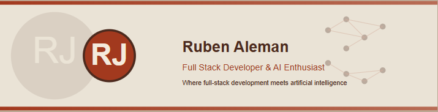

<h1 align="center">Software Developer | AI Researcher | Problem Solver</h1>
<h3 align="center">Building innovative solutions at the intersection of code and AI</h3>

  

- 🔭 I'm currently working on **Generative AI models including DCGANs, VAEs, and U-Net architectures**
- 🎓 Computer Science graduate with focus on **AI & Deep Learning**
<!---- 🚀 Accepted into Master's in Computer Science program for further AI specialization-->
- 💻 Skilled in **full-stack development** with expertise in PyTorch and TensorFlow frameworks
<!--- 👨‍💻 Most of my projects are available on ✨<a href="YOUR_PORTFOLIO_URL">my Portfolio Website</a>✨-->
- 🧠 Passionate about **Generative Models, Image Generation, and Deep Neural Networks**
- 🏋️ **Fun fact**: I get more excited about optimizing code than most people get about vacation plans!!
- 🥅 **2025 Goal**: Advance my expertise in generative AI through research projects

##  Connect with Me

<!--

-->

##  Languages

##  Tools & Technologies

##  Frameworks & Libraries

##  AI & Machine Learning

##  AI Research & Projects

- 🧮 **GANs & DCGANs**: Implementing and optimizing DCGAN models for image generation
- 🖼️ **VAE & Autoencoders**: Working with Variational Autoencoders for image reconstruction and generation
- 🔍 **U-Net Architecture**: Implementing U-Net for image segmentation tasks
- 📊 **MNIST Classification**: Developed various deep learning models for the MNIST dataset
- 📏 **KL Divergence & Loss Functions**: Researching and implementing advanced loss metrics
- 🎓 **Master's Research**: Focusing on generative AI models and their applications

##  GitHub Stats

##  Projects & Repositories

- 🏆 **[SportsChat+](https://sportschatplus-ehfub6gedrhyfmbt.centralus-01.azurewebsites.net)**: A database-driven web platform for sports enthusiasts
<!-- More projects coming soon -->
<!-- Replace these with your actual repositories once created -->
<!--

-->

  <i style="color: #F4EADC;">Where full-stack development meets artificial intelligence!</i>

