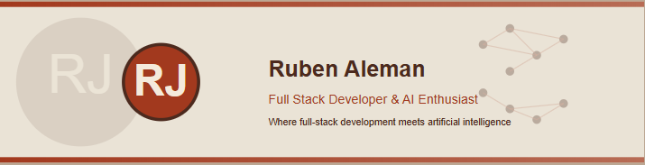

<h1 align="center">AI Researcher | Machine Learning Engineer | Reinforcement Learning Specialist</h1>
<h3 align="center">Designing intelligent systems that optimize complex workflows under uncertainty</h3>

  

- 🔭 Currently doing **Graduate Research in Federated Learning Security** at UTRGV under Dr. Sergei Chuprov
- 🎓 **MS Computer Science** – University of Texas Rio Grande Valley (Expected May 2027)
- 🧠 Specializing in **Reinforcement Learning, Transformer Fine-Tuning, and Multi-Agent LLM Systems**
- 🚀 Applying to **MS in Artificial Intelligence – University of Texas at Austin**
- 💻 Building production-grade AI: DQN portfolio optimization, DeBERTa-v3 prompt injection detection, multi-agent clinical workflow automation
- 🏥 Background as **Clinical Trials Coordinator** — bridging operational systems and AI engineering
- 🏋️ **Fun fact**: I get more excited about optimizing code than most people get about vacation plans!!
- 🥅 **2026 Goal**: Advance into applied AI engineering, designing decision systems that optimize workflows under uncertainty

##  Connect with Me

##  Languages

##  Tools & Technologies

##  Frameworks & Libraries

##  AI & Machine Learning

##  Current Research & Projects

- 🔐 **Federated Learning Security** *(Active Research)* — Developing server-side anomaly detection to identify malicious client updates in FL systems; implementing robust aggregation under adversarial and non-IID distributions using the Flower framework
- 📈 **Portfolio Optimization via Deep Q-Network (DQN)** — Architected a DQN to automate Buy/Sell/Hold decisions for AAPL, TSLA, and TQQQ modeling markets as a Markov Decision Process; implemented Bellman-based value updates, experience replay, and target-network stabilization across 2017–2024 data
- 🛡️ **Multi-Stage Fine-Tuning of DeBERTa-v3 for Prompt Injection Detection** — Three-stage domain adaptation pipeline across Safe-Guard, SPML, and NVIDIA Aegis datasets; achieved **86.4% accuracy** and **87.2% F1** on NVIDIA Aegis benchmark
- 🤖 **Multi-Agent LLM System for Clinical Workflow Automation** — Designed specialized Planning, Design, and Implementation agents with task decomposition and prompt routing; integrated into a Next.js + Prisma backend with OAuth and background scheduling
- 🎵 **Emotional Analysis of Popular Music via Lyrics Sentiment** — API-driven pipeline analyzing 8,500+ tracks via Spotify and Genius APIs; applied VADER sentiment analysis and PCA for dimensionality reduction

##  Earlier Work

- 🧮 **GANs & DCGANs**: Implemented and optimized DCGAN models for image generation
- 🖼️ **VAE & Autoencoders**: Variational Autoencoders for image reconstruction and generation
- 🔍 **U-Net Architecture**: U-Net implementation for image segmentation tasks
- 📊 **MNIST Classification**: Deep learning model benchmarking across multiple architectures

##  GitHub Stats

##  Projects & Repositories

- 🎙️ **[NarrVoce](https://narrvoca.com)** — AI-powered narration tool
- 🏆 **[SportsChat+](https://sportschatplus-8239d.web.app)** — A database-driven web platform for sports enthusiasts

  <i style="color: #F4EADC;">Transforming abstract models into deployable intelligent infrastructure.</i>

